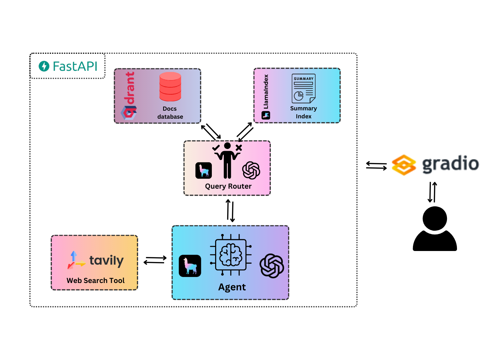

<h1 align="center">LlamaIndex Docs Agent</h1>

<h2 align="center">A useful companion when developing with LlamaIndex</h2>

<h3 align="center">If you find LlamaIndex Docs Agent useful, please consider to support us through donation:</h3>
<div align="center">
    <a href="https://github.com/sponsors/AstraBert"></a>
</div>
<br>
<div align="center">
    
</div>

## Install and launch🚀

The first step, common to both the Docker and the source code setup approaches, is to clone the repository and access it:

```bash
git clone https://github.com/AstraBert/llamaindex-docs-agent.git
cd llamaindex-docs-agent
```

Once there, you can choose one of the two following approaches:

### Docker (recommended)🐋

> _Required: [Docker](https://docs.docker.com/desktop/) and [docker compose](https://docs.docker.com/compose/)_

- Add the `openai_api_key` and the `tavily_api_key` variables in the [`.env.example`](./docker/.env.example) file and modify the name of the file to `.env`. Get these keys:
    + [On OpenAI Platform](https://platform.openai.com/api-keys)
    + [On Tavily](https://app.tavily.com/home/)

```bash
mv .env.example .env
```

- Launch the Docker application:

```bash
# If you are on Linux/macOS
bash start_services.sh
# If you are on Windows
.\start_services.ps1
```

You will see the application running on http://localhost:8000/gradio and you will be able to use it. Depending on your connection and on your hardware, the set up might take some time (up to 30 mins to set up) - but this is only for the first time your run it!


### Source code🗎

> _Required: [Docker](https://docs.docker.com/desktop/), [docker compose](https://docs.docker.com/compose/) and [conda](https://anaconda.org/anaconda/conda)_

- Add the `openai_api_key` and the `tavily_api_key` variables in the [`.env.example`](./docker/.env.example) file and modify the name of the file to `.env`. Get these keys:
    + [On OpenAI Platform](https://platform.openai.com/api-keys)
    + [On Tavily](https://app.tavily.com/home/)

```bash
mv .env.example .env
```

- Set up LlamaIndex Docs Agent using the dedicated script:

```bash
# For MacOs/Linux users
bash setup.sh
# For Windows users
.\setup.ps1
```

- Or you can do it manually, if you prefer:

```bash
docker compose up vector_db -d

conda env create -f environment.yml
conda activate llamaindex-docs

python3 scripts/loadData.py

cd scripts/
uvicorn main:app --host 0.0.0.0 --port 8000

conda deactivate
```

You will see the application running on http://localhost:8000/gradio and you will be able to use it.

## How it works

<div align='center'>
    
</div>

Whenever the user asks a question from the Gradio chat interface running on http://localhost:8000/gradio, this question is processed by the `/message` endpoint of the FastAPI-managed API to which the Gradio app is attached. The `/message` endpoint passes the user message to the ReAct agent, which:

- Uses the query router to select an index (summary or vector database) from which to retrieve relevant information to the user's prompt. The vector database uses hybrid search.
- Once the retrieved information is sent to the agent, it thinks whether the context is sufficient or not: if yes, it formulates a solution and returns it to the user, if no it activates the Tavily search tool
- The Tavily search tool searches the web for a solution and returns an answer to the agent, which then decides if the answer is sufficient and, in that case, returns a solution to the user


## Contributing

Contributions are always welcome! Follow the contributions guidelines reported [here](CONTRIBUTING.md).

## License and rights of usage

The software is provided under MIT [license](./LICENSE).
